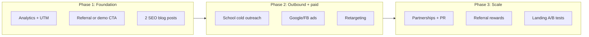

# Bharat Athlete — High client acquisition promotion plan

Goal: Maximize signups and paying schools (tenants) in India. The plan mixes **ethical** channels with **aggressive-but-legal** tactics. Nothing in this plan should rely on fake engagement, illegal data use, or deceptive claims.

---

## 1. Foundation (already in place)

- Marketing site: [apps/web/src/app/(marketing)](apps/web/src/app/(marketing)) — landing, features, pricing, about, contact, blog, legal.
- Self-serve signup: [apps/web/src/app/signup](apps/web/src/app/signup), [apps/api/src/routes/auth.ts](apps/api/src/routes/auth.ts) (POST /auth/signup).
- Trial: 1 month, 2 sports per competition; Pro via Stripe.
- No analytics/tracking in repo yet — add for measurement.

---

## 2. Ethical channels (high trust, sustainable)

| Channel                     | Tactics                                                                                                                                                                                                                                                                                                                        | Notes                                                                                              |
| --------------------------- | ------------------------------------------------------------------------------------------------------------------------------------------------------------------------------------------------------------------------------------------------------------------------------------------------------------------------------ | -------------------------------------------------------------------------------------------------- |
| **SEO**                     | Target keywords: "school sports tournament software India", "inter-school competition management", "sports event management for schools". Optimize [sitemap](apps/web/src/app/sitemap.ts), [metadata](apps/web/src/app/(marketing)/page.tsx), blog for long-tail. Add location pages (e.g. "Schools in Karnataka") if scaling. | Use existing blog and legal pages; add 2–4 SEO-focused posts per month.                            |
| **Content / blog**          | Case studies (anonymized school wins), "How to run a knockout in 5 steps", sport-specific guides. Link from landing and pricing.                                                                                                                                                                                               | Reuse [apps/web/content/blog](apps/web/content/blog) and [lib/blog.ts](apps/web/src/lib/blog.ts).  |
| **School partnerships**     | Partner with 2–3 pilot schools (free extended trial or discount) for testimonials and case studies. Approach PE heads, sports coordinators, school management.                                                                                                                                                                 | Requires sales/outreach; no code change.                                                           |
| **Education sector events** | Sponsor or exhibit at state/central school sports meets, CBSE/ICSE sports events, education fairs. Demo on tablet at stall; collect leads.                                                                                                                                                                                     | Offline; use signup or "Request demo" on [contact](apps/web/src/app/(marketing)/contact/page.tsx). |
| **Referral program**        | "Invite a school: you get 1 month free Pro, they get 2 months trial." Implement referral code or link in app (e.g. in billing/dashboard) and track in DB (optional new table or tenant metadata).                                                                                                                              | New: referral token in signup flow, reward logic (extend trial or discount).                       |
| **PR**                      | Press release to education and ed-tech media (India). Angle: "Indian schools get a dedicated sports management platform; talent on a stage."                                                                                                                                                                                   | No code; messaging and distribution.                                                               |

---

## 3. Aggressive-but-legal tactics (high volume, stay compliant)

| Tactic                         | How                                                                                                                                                                                                                                                                       | Boundaries                                                                                                |
| ------------------------------ | ------------------------------------------------------------------------------------------------------------------------------------------------------------------------------------------------------------------------------------------------------------------------- | --------------------------------------------------------------------------------------------------------- |
| **Cold outreach to schools**   | Build list of schools (public directories, CBSE/state board lists). Email principals, sports coordinators with a short pitch + link to signup or "Book a demo". Use a clear subject, one clear CTA, and **unsubscribe link**.                                             | Comply with Indian IT Act and any applicable email rules; no buying illegal lists; honor opt-outs.        |
| **Paid acquisition**           | Google Ads (keywords: school sports management, tournament software India). Facebook/Instagram ads targeting job titles (PE teacher, sports coordinator) and interests (school management, education). Retarget visitors who hit /pricing or /signup but did not sign up. | Use honest ad copy; no misleading claims; respect platform policies.                                      |
| **Landing page optimization**  | A/B test headline and CTA on [landing](apps/web/src/app/(marketing)/page.tsx). Add social proof (logos, "Used by X schools", testimonials when available). Single clear CTA above fold: "Start free trial" → /signup.                                                     | No fake testimonials or inflated numbers.                                                                 |
| **Scarcity / urgency (legal)** | "Free trial ends in 30 days" (true). "Only Y spots left for [city] pilot" only if true. Limited-time discount for first N schools in a state (real limit).                                                                                                                | Do not fake scarcity; terms must be real and enforceable.                                                 |
| **Retargeting**                | Pixel or tag on marketing site (with consent banner if in EU/UK). Retarget visitors to /pricing or /signup with reminder ads.                                                                                                                                             | Consent where required; disclose in [legal/privacy](apps/web/src/app/(marketing)/legal/privacy/page.tsx). |
| **Influencer / ambassador**    | PE teachers or sports influencers (YouTube, Instagram) who demo the product or share a referral link. Paid or free; disclose if sponsored.                                                                                                                                | Authentic use; no fake "influencers" or bot views.                                                        |

---

## 4. What to avoid (unethical / illegal)

- **Fake reviews or testimonials** — Only use real schools with permission.
- **Fake signups or bot traffic** — Inflates metrics and can trigger fraud checks (e.g. Stripe).
- **Deceptive ads** — No "Government approved" or false claims; no misleading screenshots or pricing.
- **Spam** — No unsolicited bulk email/SMS without consent and opt-out; respect Do Not Disturb and local rules.
- **Black-hat SEO** — No buying links, cloaking, or keyword stuffing in a way that violates guidelines.
- **Data misuse** — No scraping or using student/school data for targeting without clear consent and policy.

---

## 5. Technical and product enablers

- **Analytics** — Add a lightweight analytics solution (e.g. Plausible, Posthog, or GA4 with consent) on marketing and signup to measure traffic, signup funnel, and conversions. No implementation detail in plan; just ensure events: page view (landing, pricing, signup), signup started, signup completed.
- **UTM and source tracking** — Pass UTM params (source, medium, campaign) through signup and store on tenant or first user (e.g. in DB or in app) to attribute which channel drove the client.
- **Referral system** — Optional: add `referralCode` or `invitedByTenantId` to signup flow and a simple reward (extra trial or discount). See [apps/api/src/routes/auth.ts](apps/api/src/routes/auth.ts) signup and tenant creation.
- **"Request demo" or "Contact sales"** — If not already, ensure [contact](apps/web/src/app/(marketing)/contact/page.tsx) or a CTA captures lead (email + school name) for follow-up; store in DB or send to CRM/email tool.

---

## 6. Suggested sequencing (first 90 days)

- **Weeks 1–2:** Add analytics and UTM; publish 1–2 SEO posts; finalize referral or "Request demo" flow.
- **Weeks 3–6:** Start cold outreach (50–100 schools/week); launch small paid budget (Google + one social); enable retargeting.
- **Weeks 7–12:** Land 1–2 pilot partnerships; issue press release; run first A/B test on landing; activate referral rewards if built.

---

## 7. Success metrics

- **Acquisition:** Signups per week; cost per signup (by channel via UTM).
- **Activation:** Tenants that create at least one competition within 14 days.
- **Revenue:** Trial → Pro conversion rate; MRR.
- **Referral:** Referral signups and reward redemptions (if implemented).

Track in a simple dashboard (spreadsheet or analytics tool); no need to build a full internal dashboard in the first phase.

---

## 8. Summary

| Category                 | Examples                                                                                                          |
| ------------------------ | ----------------------------------------------------------------------------------------------------------------- |
| **Ethical**              | SEO, blog, partnerships, events, referral program, PR                                                             |
| **Aggressive but legal** | Cold outreach (with opt-out), paid ads, retargeting, landing A/B tests, scarcity when real, influencer/ambassador |
| **Out of scope**         | Fake reviews, bot signups, deceptive ads, spam, black-hat SEO, data misuse                                        |

All recommended tactics are intended to be compliant with Indian law and platform policies. Where consent or privacy applies (e.g. retargeting, email), document in [legal/privacy](apps/web/src/app/(marketing)/legal/privacy/page.tsx) and obtain consent where required.