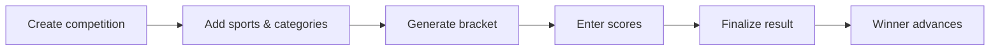

Different sports need different scorecards. Here’s how we handle that and how brackets work.

Flow for running a knockout:

**Sport-specific scorecards.** Each sport (cricket, football, basketball, volleyball, kabaddi, etc.) has a template: the right fields for that game. You enter scores (and optionally player stats); the system computes summaries and who won. No more guessing which spreadsheet column to use.

**Knockout brackets.** For team events you create categories and teams, then generate a bracket. Each match has a scorecard. When you finalize a result, the winner advances automatically. You see the full draw and who’s through to the next round.

**Individual events.** For athletics or other individual sports you add participants and enter results (e.g. time or distance). The system can rank by best result. Leaderboards and results stay in one place.

**Drafts and finalize.** You can save scorecards as drafts and only finalize when you’re sure. Once finalized, the match is complete and the bracket updates. That keeps data clean and avoids accidental changes.

All of this is tenant-scoped: your school’s data stays separate and secure.
