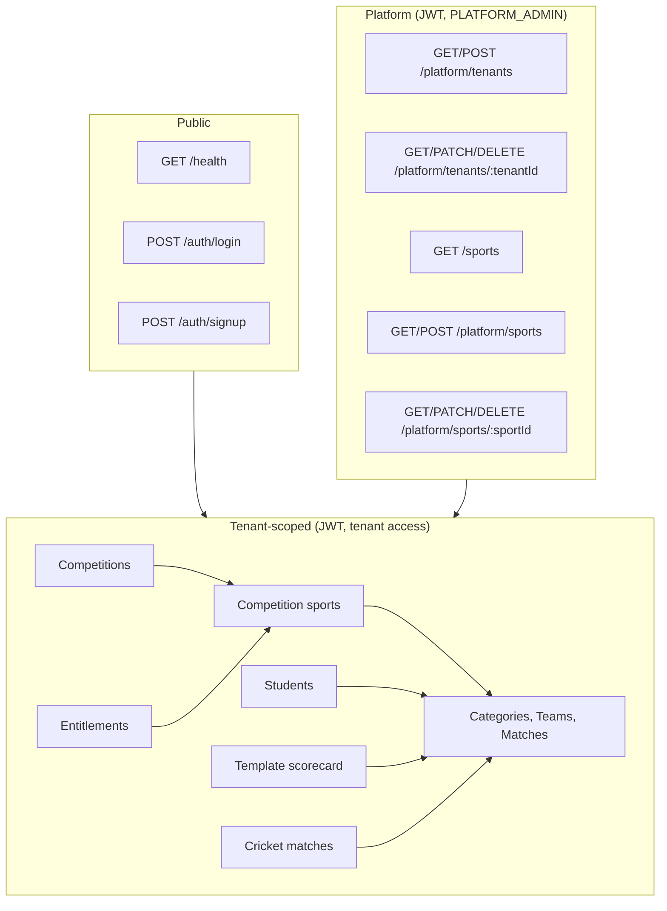
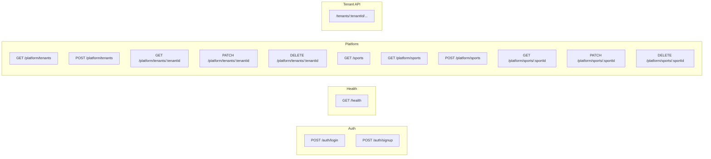
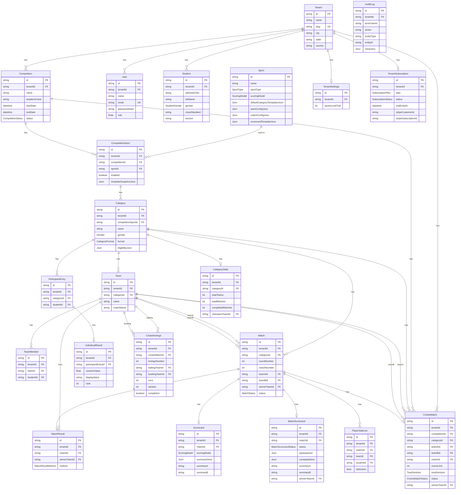
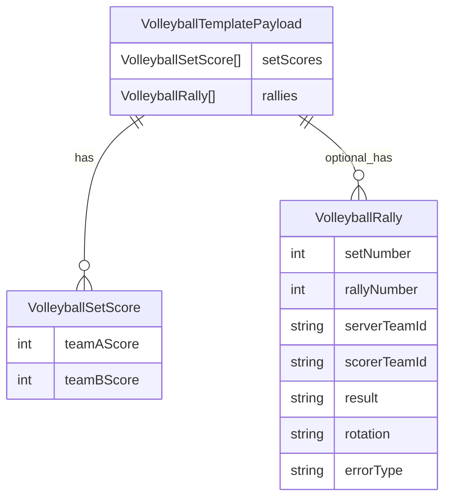

# Bharat Athlete — API & Schema (Mermaid)

Mermaid diagrams for all API routes and the Prisma database schema. Base URL for API: `http://localhost:3001` (or `API_URL`).

---

## 1. API overview (flowchart)



---

## 2. API routes by method (sequence-style list)



---

## 3. Full API tree (hierarchy)

```mermaid
flowchart TD
  ROOT["API root"]
  ROOT --> GET_health["GET /health"]
  ROOT --> auth["/auth"]
  ROOT --> platform["/platform"]
  ROOT --> tenants["/tenants/:tenantId"]

  auth --> POST_login["POST /auth/login"]
  auth --> POST_signup["POST /auth/signup"]

  platform --> platform_tenants["/platform/tenants"]
  platform --> platform_sports["/platform/sports"]
  platform_tenants --> GET_tenants["GET"]
  platform_tenants --> POST_tenants["POST"]
  platform_tenants --> GET_tenant["GET /:tenantId"]
  platform_tenants --> PATCH_tenant["PATCH /:tenantId"]
  platform_tenants --> DELETE_tenant["DELETE /:tenantId"]
  platform_sports --> GET_sports["GET"]
  platform_sports --> POST_sport["POST"]
  platform_sports --> GET_sport["GET /:sportId"]
  platform_sports --> PATCH_sport["PATCH /:sportId"]
  platform_sports --> DELETE_sport["DELETE /:sportId"]

  tenants --> GET_students["GET /students"]
  tenants --> POST_students["POST /students"]
  tenants --> GET_student["GET /students/:studentId"]
  tenants --> PATCH_student["PATCH /students/:studentId"]
  tenants --> DELETE_student["DELETE /students/:studentId"]
  tenants --> POST_import["POST /students/import-csv"]
  tenants --> GET_entitlements["GET /entitlements"]
  tenants --> GET_competitions["GET /competitions"]
  tenants --> POST_competition["POST /competitions"]
  tenants --> GET_competition["GET /competitions/:competitionId"]
  tenants --> PATCH_competition["PATCH /competitions/:competitionId"]
  tenants --> DELETE_competition["DELETE /competitions/:competitionId"]
  tenants --> GET_comp_sports["GET /competitions/:competitionId/sports"]
  tenants --> POST_comp_sport["POST /competitions/:competitionId/sports"]
  tenants --> GET_comp_sport["GET /competition-sports/:competitionSportId"]
  tenants --> GET_categories["GET .../categories"]
  tenants --> POST_categories["POST .../categories"]
  tenants --> GET_category["GET .../categories/:categoryId"]
  tenants --> PATCH_category["PATCH .../categories/:categoryId"]
  tenants --> DELETE_category["DELETE .../categories/:categoryId"]
  tenants --> GET_teams["GET .../categories/:categoryId/teams"]
  tenants --> POST_team["POST .../categories/:categoryId/teams"]
  tenants --> GET_team["GET .../teams/:teamId"]
  tenants --> PATCH_team["PATCH .../teams/:teamId"]
  tenants --> DELETE_team["DELETE .../teams/:teamId"]
  tenants --> POST_members["POST .../teams/:teamId/members"]
  tenants --> DELETE_member["DELETE .../teams/:teamId/members/:memberId"]
  tenants --> POST_bracket["POST .../bracket/generate"]
  tenants --> GET_matches["GET .../matches"]
  tenants --> GET_match["GET /matches/:matchId"]
  tenants --> GET_scorecard["GET /matches/:matchId/scorecard"]
  tenants --> PUT_scorecard["PUT /matches/:matchId/scorecard"]
  tenants --> POST_finalize["POST /matches/:matchId/finalize"]
  tenants --> GET_template["GET /matches/:matchId/template-scorecard"]
  tenants --> PUT_template["PUT /matches/:matchId/template-scorecard"]
  tenants --> POST_template_final["POST /matches/:matchId/template-scorecard/finalize"]
  tenants --> GET_participants["GET .../participants"]
  tenants --> POST_participants["POST .../participants"]
  tenants --> POST_bulk["POST .../participants/bulk"]
  tenants --> DELETE_entry["DELETE .../participants/:entryId"]
  tenants --> PUT_results["PUT .../results"]
  tenants --> GET_leaderboard["GET .../leaderboard"]
  tenants --> POST_cricket["POST /cricket/matches"]
  tenants --> GET_cricket_list["GET /cricket/matches"]
  tenants --> GET_cricket["GET /cricket/matches/:id"]
  tenants --> PUT_cricket["PUT /cricket/matches/:id"]
  tenants --> PUT_innings["PUT /cricket/matches/:id/innings/:inningsNumber"]
  tenants --> POST_cricket_final["POST /cricket/matches/:id/finalize"]
```



---

## 4. Database schema (ER diagram)



---

## 5. Schema core entities (simplified)

```mermaid
erDiagram
  Tenant ||--o{ Competition : has
  Tenant ||--o{ User : has
  Tenant ||--o{ Student : has
  Tenant ||--o| TenantSettings : has
  Tenant ||--o| TenantSubscription : has
  Competition ||--o{ CompetitionSport : has
  Sport ||--o{ CompetitionSport : "sport"
  CompetitionSport ||--o{ Category : has
  Category ||--o{ Team : has
  Category ||--o{ Match : has
  Team ||--o{ TeamMember : has
  Team ||--o{ Match : "teamA teamB"
  Match ||--o| MatchScorecard : has
  Match ||--o| MatchResult : has
  Match ||--o{ PlayerStatLine : has
  Tenant {
    id name slug city state country
  }
  Competition {
    id tenantId name academicYear status
  }
  CompetitionSport {
    id competitionId sportId enabled
  }
  Category {
    id competitionSportId name gender format
  }
  Team {
    id categoryId name coachName
  }
  Match {
    id categoryId roundNumber matchNumber teamAId teamBId winnerTeamId status
  }
  MatchScorecard {
    id matchId status payloadJson computedJson winnerTeamId
  }
  MatchResult {
    id matchId winnerTeamId method
  }
```

---

## 6. Enums (reference)

| Enum | Values |
|------|--------|
| **SportType** | TEAM, INDIVIDUAL |
| **ScoringModel** | SIMPLE_POINTS, SETS, CRICKET_LITE, TIME_DISTANCE, ATTEMPTS_BEST_OF |
| **Role** | PLATFORM_ADMIN, SCHOOL_ADMIN, COORDINATOR, COACH, VIEWER |
| **Gender** | BOYS, GIRLS, MIXED, OPEN |
| **StudentGender** | MALE, FEMALE, OTHER |
| **CompetitionStatus** | DRAFT, LIVE, CLOSED |
| **CategoryFormat** | KNOCKOUT, INDIVIDUAL |
| **MatchStatus** | SCHEDULED, READY, IN_PROGRESS, COMPLETED |
| **MatchResultMethod** | NORMAL, BYE, WALKOVER, TIEBREAKER |
| **MatchScorecardStatus** | DRAFT, FINAL |
| **SubscriptionPlan** | TRIAL, PRO |
| **SubscriptionStatus** | ACTIVE, PAST_DUE, CANCELED, INCOMPLETE, TRIALING |
| **CricketMatchStatus** | SCHEDULED, IN_PROGRESS, COMPLETED, TBD, NO_RESULT, ABANDONED |
| **CricketResultType** | NORMAL, TIE, NO_RESULT, TBD |
| **TossDecision** | BAT, BOWL |

---

## 7. API quick reference (table)

| Method | Path | Auth | Description |
|--------|------|------|-------------|
| GET | /health | — | Health check |
| POST | /auth/login | — | Login (email, password) |
| POST | /auth/signup | — | Sign up (tenant + admin) |
| GET | /sports | — | List sports (public catalog) |
| GET | /platform/tenants | Platform | List tenants |
| POST | /platform/tenants | Platform | Create tenant |
| GET | /platform/tenants/:tenantId | Platform | Get tenant |
| PATCH | /platform/tenants/:tenantId | Platform | Update tenant |
| DELETE | /platform/tenants/:tenantId | Platform | Delete tenant |
| GET | /platform/sports | Platform | List sports |
| POST | /platform/sports | Platform | Create sport |
| GET | /platform/sports/:sportId | Platform | Get sport |
| PATCH | /platform/sports/:sportId | Platform | Update sport |
| DELETE | /platform/sports/:sportId | Platform | Delete sport |
| GET | /tenants/:tenantId/entitlements | Tenant | Get entitlements (trial/Pro limits) |
| GET | /tenants/:tenantId/students | Tenant | List students |
| POST | /tenants/:tenantId/students | Tenant | Create student |
| GET | /tenants/:tenantId/students/:studentId | Tenant | Get student |
| PATCH | /tenants/:tenantId/students/:studentId | Tenant | Update student |
| DELETE | /tenants/:tenantId/students/:studentId | Tenant | Delete student |
| POST | /tenants/:tenantId/students/import-csv | Tenant | Import students CSV |
| GET | /tenants/:tenantId/competitions | Tenant | List competitions |
| POST | /tenants/:tenantId/competitions | Tenant | Create competition |
| GET | /tenants/:tenantId/competitions/:competitionId | Tenant | Get competition |
| PATCH | /tenants/:tenantId/competitions/:competitionId | Tenant | Update competition |
| DELETE | /tenants/:tenantId/competitions/:competitionId | Tenant | Delete competition |
| GET | /tenants/:tenantId/competitions/:competitionId/sports | Tenant | List competition sports |
| POST | /tenants/:tenantId/competitions/:competitionId/sports | Tenant | Enable sport (402 if limit) |
| GET | /tenants/:tenantId/competition-sports/:competitionSportId | Tenant | Get competition sport |
| GET | .../competition-sports/:competitionSportId/categories | Tenant | List categories |
| POST | .../competition-sports/:competitionSportId/categories | Tenant | Create category |
| POST | .../categories/from-templates | Tenant | Create categories from templates |
| GET | .../categories/:categoryId | Tenant | Get category |
| PATCH | .../categories/:categoryId | Tenant | Update category |
| DELETE | .../categories/:categoryId | Tenant | Delete category |
| GET | .../categories/:categoryId/teams | Tenant | List teams |
| POST | .../categories/:categoryId/teams | Tenant | Create team |
| GET | .../teams/:teamId | Tenant | Get team |
| GET | .../teams/:teamId/available-students | Tenant | Search students for team |
| PATCH | .../teams/:teamId | Tenant | Update team |
| DELETE | .../teams/:teamId | Tenant | Delete team |
| POST | .../teams/:teamId/members | Tenant | Add member |
| DELETE | .../teams/:teamId/members/:memberId | Tenant | Remove member |
| POST | .../categories/:categoryId/bracket/generate | Tenant | Generate knockout bracket |
| GET | .../categories/:categoryId/matches | Tenant | List matches |
| GET | /tenants/:tenantId/matches/:matchId | Tenant | Get match (full) |
| GET | .../matches/:matchId/scorecard | Tenant | Get legacy scorecard |
| PUT | .../matches/:matchId/scorecard | Tenant | Upsert legacy scorecard |
| POST | .../matches/:matchId/finalize | Tenant | Finalize match (legacy) |
| GET | .../matches/:matchId/template-scorecard | Tenant | Get template scorecard |
| PUT | .../matches/:matchId/template-scorecard | Tenant | Put template scorecard |
| POST | .../matches/:matchId/template-scorecard/finalize | Tenant | Finalize template scorecard |
| GET | .../categories/:categoryId/participants | Tenant | List participants |
| POST | .../categories/:categoryId/participants | Tenant | Add participant |
| POST | .../participants/bulk | Tenant | Bulk add participants |
| DELETE | .../participants/:entryId | Tenant | Remove participant |
| PUT | .../categories/:categoryId/results | Tenant | Bulk put individual results |
| GET | .../categories/:categoryId/leaderboard | Tenant | Get leaderboard |
| POST | /tenants/:tenantId/cricket/matches | Tenant | Create cricket match |
| GET | /tenants/:tenantId/cricket/matches | Tenant | List cricket matches |
| GET | .../cricket/matches/:id | Tenant | Get cricket match |
| PUT | .../cricket/matches/:id | Tenant | Update cricket match |
| PUT | .../cricket/matches/:id/innings/:inningsNumber | Tenant | Update innings |
| POST | .../cricket/matches/:id/finalize | Tenant | Finalize cricket match |

---

## 8. Volleyball template scorecard (contract example)

For indoor volleyball (6v6, rally scoring) the platform uses the **template scorecard** APIs with `ScoringModel = SETS`:

- `GET /tenants/:tenantId/matches/:matchId/template-scorecard`
  - Returns a `template` where `sportKey = "volleyball"` and `scoringModel = "SETS"`.
  - `template.match.constraints` describes the set rules:
    - `bestOfSets` (e.g. 5)
    - `setPoints` / `regularSetPoints` (e.g. 25)
    - `decidingSetPoints` (e.g. 15)
    - `winBy` (e.g. 2)
    - `maxPointsCap` (optional, e.g. 30)
- `PUT /tenants/:tenantId/matches/:matchId/template-scorecard`
- `POST /tenants/:tenantId/matches/:matchId/template-scorecard/finalize`
  - Body (volleyball-specific shape) – simplified:



Validation rules (centralized in the score engine):

- At least one set score is required.
- Number of sets cannot exceed `bestOfSets` (unless `allowTieBreakOverride` is set).
- Per set:
  - Winning team must reach at least the configured target (`setPoints` or `decidingSetPoints`).
  - Scores cannot exceed `maxPointsCap` when configured.
  - Winner must lead by at least `winBy` points, unless the winning score equals `maxPointsCap`.

*Generated from `apps/api/src/routes/*` and `packages/db/prisma/schema.prisma`.*
