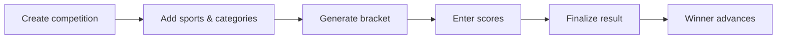
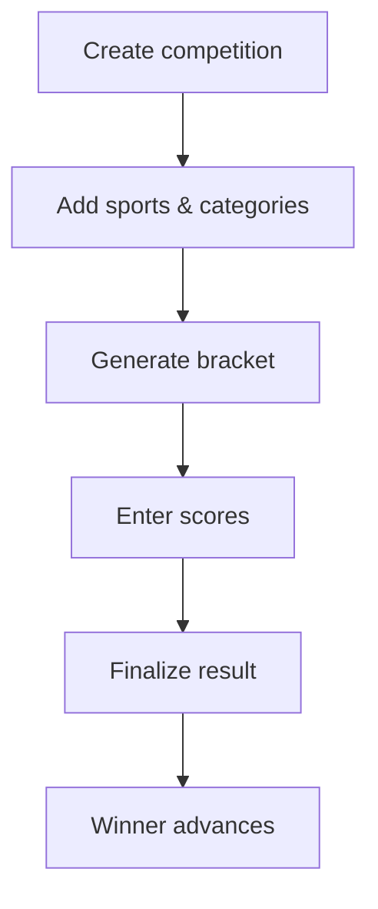
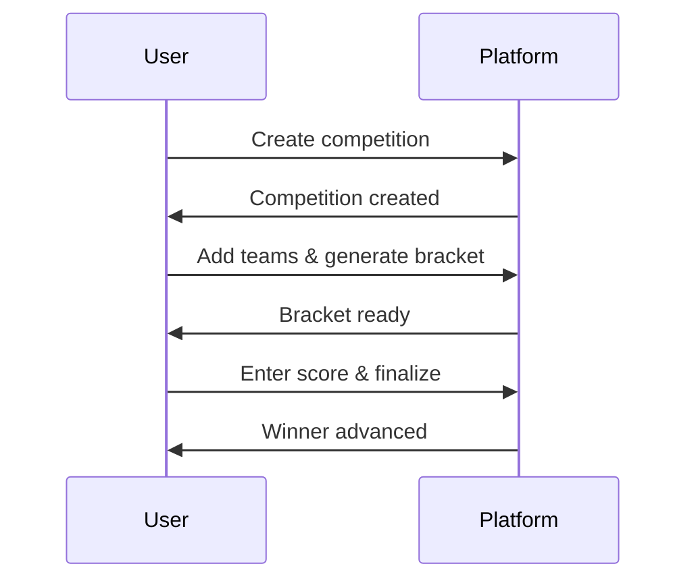
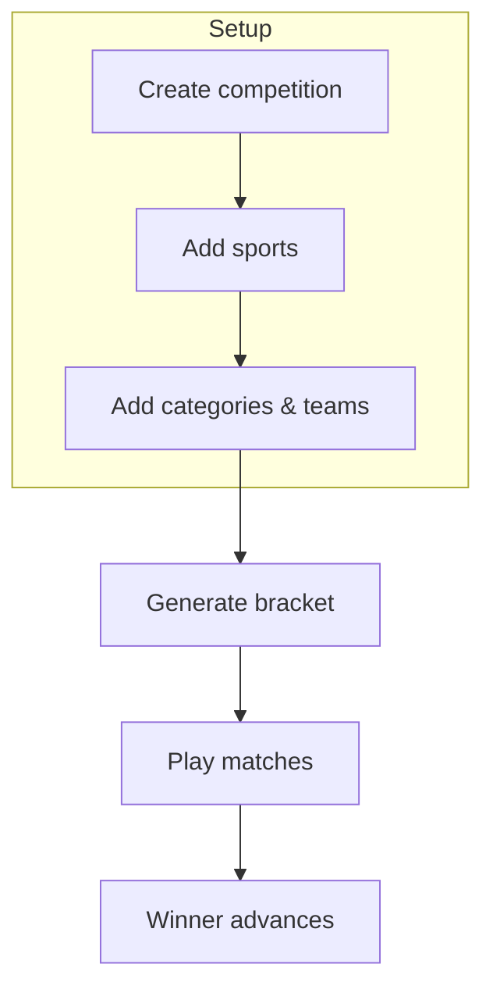
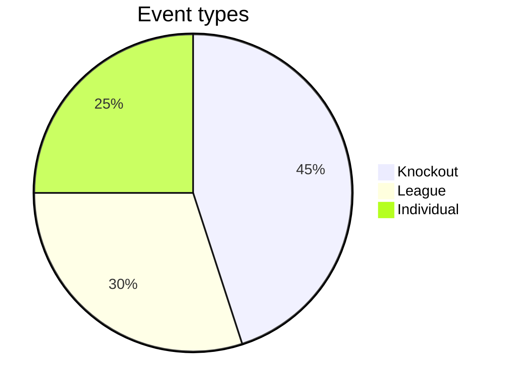
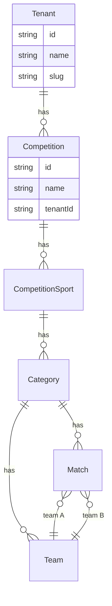
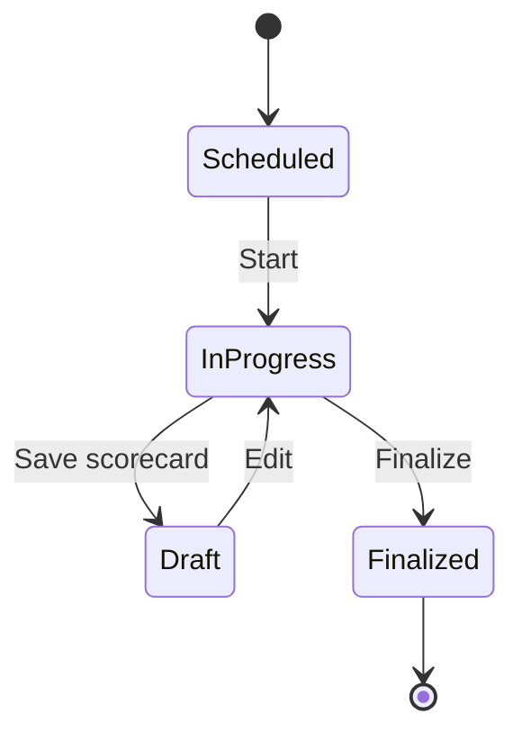
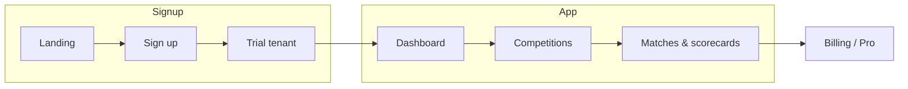

# Mermaid diagrams

Reference and examples for Mermaid diagrams. Use these in blog posts (wrap in ` ```mermaid ` code blocks) or copy into any Markdown that supports Mermaid.

---

## 1. Flowchart (left to right)



---

## 2. Flowchart (top to bottom)



---

## 3. Sequence diagram



---

## 4. Bracket / process with subgraphs



---

## 5. Pie chart



---

## 6. Entity relationship (data model sketch)



---

## 7. State diagram (match lifecycle)



---

## 8. User journey (flowchart)



---

## Syntax quick reference

| Diagram type   | First line              | Example use           |
|----------------|-------------------------|------------------------|
| Flowchart      | `flowchart LR` or `TD`  | Processes, steps       |
| Sequence       | `sequenceDiagram`       | User ↔ system flows    |
| Entity-relation| `erDiagram`             | Tables, relationships  |
| State          | `stateDiagram-v2`       | Status / lifecycle     |
| Pie            | `pie title Title`       | Proportions            |
| Gantt          | `gantt`                 | Timelines              |

- **LR** = left–right, **TD** = top–down  
- Nodes: `A[text]` rectangle, `B(text)` rounded, `C{text}` diamond  
- Arrows: `-->` solid, `-.->` dotted, `==>` thick  

[Full syntax: https://mermaid.js.org](https://mermaid.js.org)
